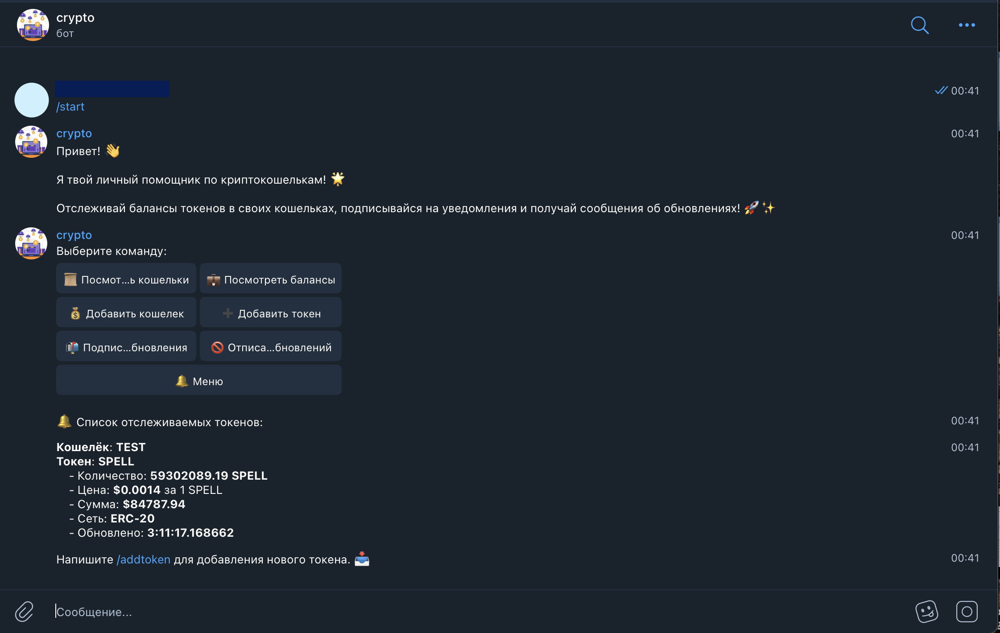

# WalletWatchTgBot
### Telegram Cryptocurrency Wallet Tracker Bot
<div align="center">
    
    <br/>
</div>
<p align="center">
  <a href="https://github.com/Louis3797/awesome-readme-template/blob/master/LICENSE">
    
  </a>
</p>
<h4 align="center">
    <a href="https://t.me/crypto_wallet_liza_bot">View Demo</a>
</h4>
This Telegram bot, developed using Python and the aiogram framework, serves as a cryptocurrency wallet tracker for wallets in the ERC20 and BEP20 networks. 

## Features
<!-- <div align="center">
    
</div> -->

- **Wallet Configuration Management**: Users can add, remove, and manage configurations of their cryptocurrency wallets.
- **Token Addition**: Users can add tokens to their wallets for monitoring their balances.
- **Balance Updates**: The bot provides updates on the balances of saved tokens.
- **Opt-in/Opt-out Updates**: Users can choose to receive or stop receiving updates on their saved tokens.
- **Wallet and Token Deletion**: Users can delete their wallets and tokens from the bot's records.

## Usage
1. ***Start the Bot***: 
*Start a conversation with the bot by searching for it on Telegram or clicking on a provided link.*
2. ***Adding Wallets***:
*Use the /addwallet command to add configurations for your cryptocurrency wallets. Follow the prompts to enter necessary details.*
3. ***Adding Tokens***:
*Once wallets are added, use the /addtoken command to add tokens to your wallets for balance tracking.*
4. ***Receiving Updates***:
*By default, users receive updates on their saved tokens. Use the /connect command to toggle updates on or /stop tooff.*
5. ***Managing Wallets and Tokens***:
*Use the /deletewallet and /deletetoken commands to remove wallets and tokens, respectively.*
6. ***Help***:
*Use the /help command to get information via telegram bot.*

## Installation

1. Clone the Repository:
```bash
git clone https://github.com/yourusername/telegram-crypto-bot.git
```

2. Install Dependencies:
```bash
make prepare
```

3. Configuration:

Copy `.env.sample` to a new file called `.env` and configure the settings as described in the Environment variables section.

```bash
BOT_TOKEN=your_bot_token_here
```

4. Run the bot:

```bash
make run
```

## Deploy the app

Clone this repository onto your remote server and execute the following commands:

1. Clone Project Repository in server

Clone your project repository:

```bash
git clone https://github.com/WalletWatch/wallet_watch_tg_bot.git
```

2. Configuration:

Copy `.env.sample` to a new file called `.env` and configure the settings as described in the Environment variables section.

```bash
BOT_TOKEN=your_bot_token_here
```

3. Install Dependencies

Go to the infra folder and install necessary packages and applications:

```bash
make prepare
```

4. Run bot

```bash
make run 
```

## Contributing
Contributions are welcome! If you have any suggestions, feature requests, or bug reports, feel free to open an issue or submit a pull request.

## License
This project is licensed under the MIT License.
